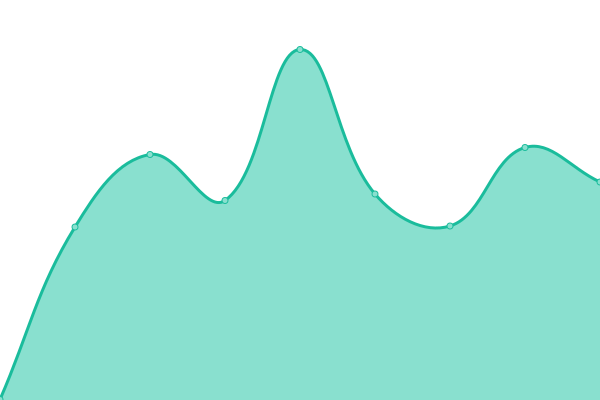

# [📈 Live Status](https://uptime.vahryiskandar.my.id): <!--live status--> **🟩 All systems operational**

This repository contains the open-source uptime monitor and status page for [Vahry](https://uptime.vahryiskandar.my.id), powered by [Upptime](https://github.com/upptime/upptime).

With [Upptime](https://upptime.js.org), you can get your own unlimited and free uptime monitor and status page, powered entirely by a GitHub repository. We use [Issues](https://github.com/DemuraAIdev/upmtimes/issues) as incident reports, [Actions](https://github.com/DemuraAIdev/upmtimes/actions) as uptime monitors, and [Pages](https://uptime.vahryiskandar.my.id) for the status page.

<!--start: status pages-->
<!-- This summary is generated by Upptime (https://github.com/upptime/upptime) -->
<!-- Do not edit this manually, your changes will be overwritten -->
<!-- prettier-ignore -->
| URL | Status | History | Response Time | Uptime |
| --- | ------ | ------- | ------------- | ------ |
|  [vahryiskandar.my.id](https://vahryiskandar.my.id/) | 🟩 Up | [vahryiskandar-my-id.yml](https://github.com/DemuraAIdev/upmtimes/commits/HEAD/history/vahryiskandar-my-id.yml) | 

 229ms
     
 | 

<a href="https://uptime.vahryiskandar.my.id/history/vahryiskandar-my-id">100.00%</a>
    

|  [Analytics](http://umami.vahryiskandar.my.id/) | 🟩 Up | [analytics.yml](https://github.com/DemuraAIdev/upmtimes/commits/HEAD/history/analytics.yml) | 

 446ms
     
 | 

<a href="https://uptime.vahryiskandar.my.id/history/analytics">100.00%</a>
    

|  [Demura](http://demura.vahryiskandar.my.id/) | 🟩 Up | [demura.yml](https://github.com/DemuraAIdev/upmtimes/commits/HEAD/history/demura.yml) | 

 2185ms
     
 | 

<a href="https://uptime.vahryiskandar.my.id/history/demura">99.48%</a>
    

|  [Bin](http://bin.vahryiskandar.my.id/) | 🟩 Up | [bin.yml](https://github.com/DemuraAIdev/upmtimes/commits/HEAD/history/bin.yml) | 

 1604ms
     
 | 

<a href="https://uptime.vahryiskandar.my.id/history/bin">100.00%</a>
    

<!--end: status pages-->

[**Visit our status website →**](https://uptime.vahryiskandar.my.id)

## 📄 License

- Powered by: [Upptime](https://github.com/upptime/upptime)
- Code: [MIT](./LICENSE) © [Vahry](https://uptime.vahryiskandar.my.id)
- Data in the `./history` directory: [Open Database License](https://opendatacommons.org/licenses/odbl/1-0/)
